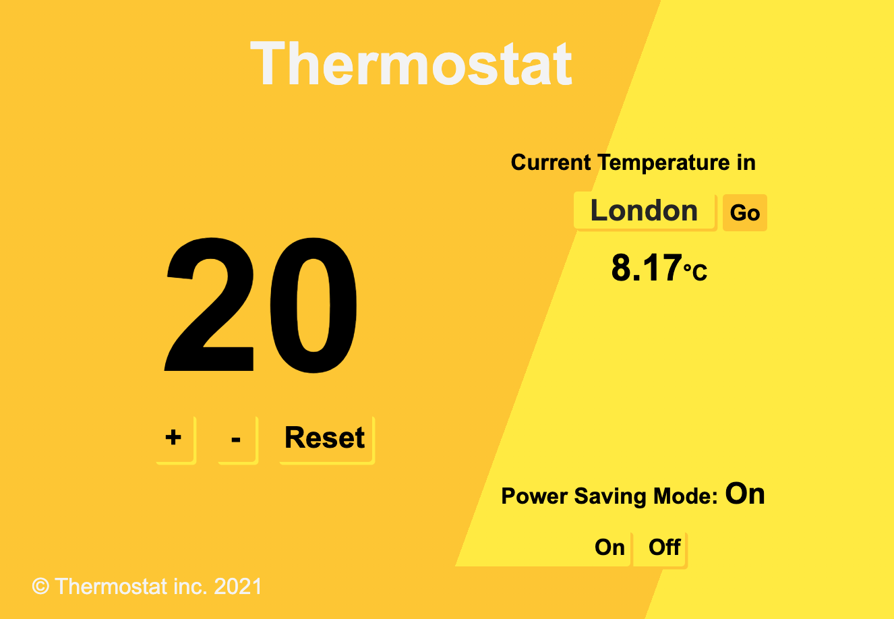

# Thermostat

Interactive thermostat application built in JavaScript



## Dependencies

- `jquery: "^3.6.0"`
- `"webpack": "^5.24.4",`
- `"webpack-cli": "^4.5.0"`

## Getting started

- Clone this repository
- cd into root of project
- Install dependencies
- start the server

```shell
git clone git@github.com:AJ8GH/thermostat.git
cd thermostat
npm install
rackup
```

- head to localhost on port 9292 in your browser - [click me!](http://localhost:9292)

## Approach and design
- Thermostat model - JavaScript
  - javascript thermostat class is handles the logic behind interface
- Thermostat model - Ruby
  - Ruby thermostat class holds the state of the thermostat settings
- Sinatra backend API - Ruby
  - The API links the js and rb models, allowing the js model to make get and post requests to retrieve and store settings data
- Interface - JavaScript / jQuery
  - The interface controls the view and ensures the user sees the correct information

Temperature goes red when energy usage is high:


And green when low usage:


Check the current temperature of any city in the world, through the open weather API:


Settings persist after refreshing or navigating away from the page:


## Specifications

- Thermostat starts at 20 degrees
- You can increase the temperature with an up function
- You can decrease the temperature with a down function
- The minimum temperature is 10 degrees
- If power saving mode is on, the maximum temperature is 25 degrees
- If power saving mode is off, the maximum temperature is 32 degrees
- Power saving mode is on by default but it can also be turned off
- You can reset the temperature to 20 with a reset function
- You can ask about the thermostat's current energy usage: < 18 is low-usage, <= 25 is medium-usage, anything else is high-usage.
- (In the challenges where we add an interface, low-usage will be indicated with green, medium-usage indicated with black, high-usage indicated with red.)

## User stories

```
As a user,
So that I don't have to adjust my thermostat when I turn it on,
I want it to start at 20 degrees

As a user,
So that I can better control my energy usage,
I want my thermostat to have a power saving mode.

As a user,
So that I don't waste energy,
I want power saving mode to be on by default.

As a user,
In case I need extra power,
I want to be able to turn off power saving mode.

As a user,
So that I am aware of my energy usage,
I want to know whether my current usage is low, medium or high.

As a user,
So that I don't accidentally boil myself alive,
I want the maximum temperature to be 32 degrees.

As a user,
So that I don't acidentally freeze myself,
I want the minimum temperature to be 10 degrees.

As a user,
So that I can quickly get back to the default temperature,
I want there to be a reset button.

As a user,
So that I know how much heating I will need,
I want to be able to check the current outdoor temperature in London.

As a product manager,
So that I can market the thermostat globally,
I want users to be able to input a city to get the temperature locally.

As a user,
So that I don't need to re-input my settings if I refresh or lose connection,
I want the thermostat to maintain my settings.
```
